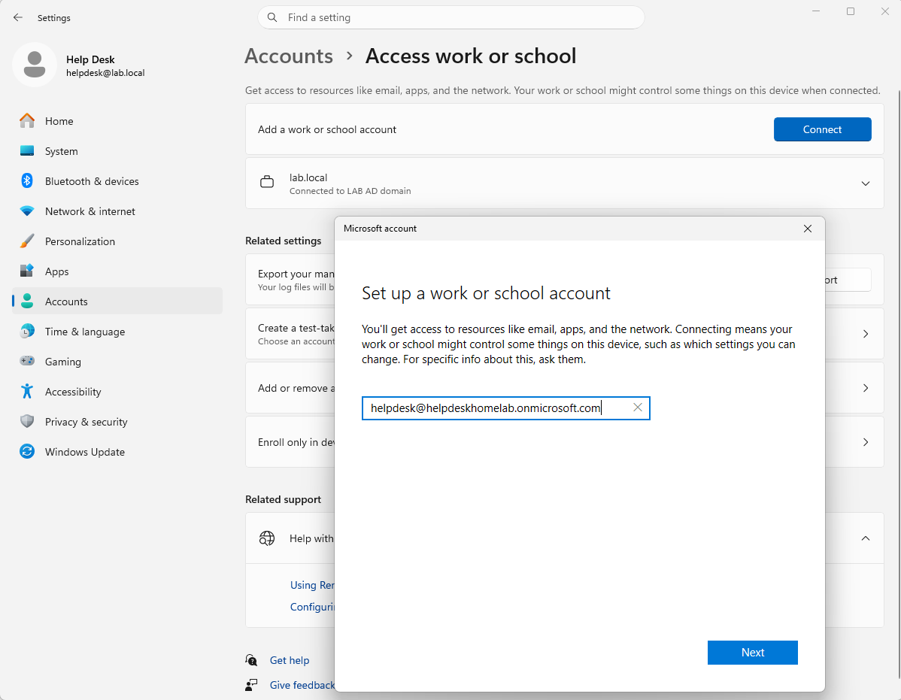
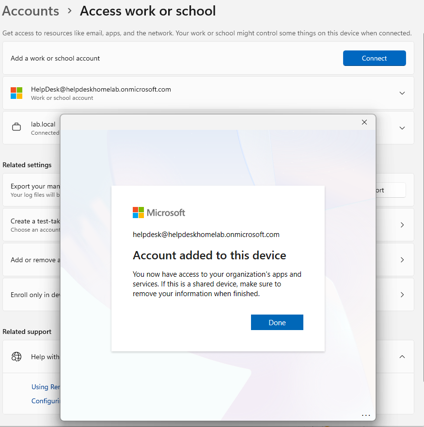
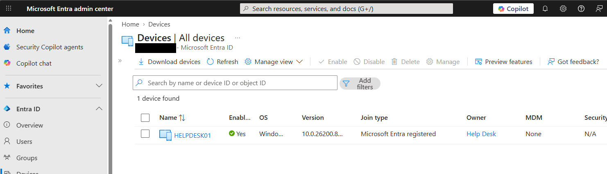
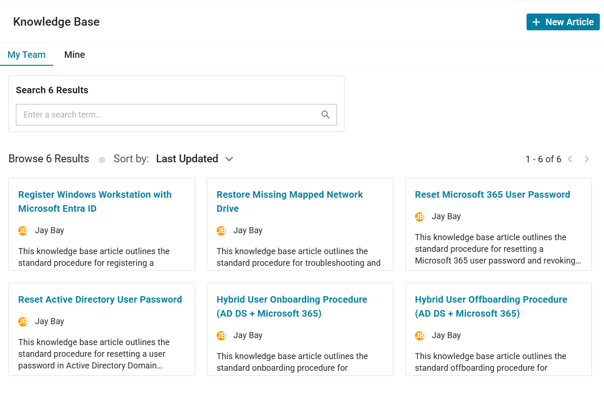

# Microsoft Entra Device Registration Workflow

## Objective

Register a domain-joined workstation with Microsoft Entra ID to establish organizational cloud identity association and prepare the endpoint for future cloud management workflows.

---

## Ticket Information

### Ticket Category
```text
Endpoint Management
```

### Priority
```text
Low
```

### Ticket Title
```text
Register HELPDESK01 with Microsoft Entra ID for cloud device management
```

### Request Source
```text
Systems Administration
```

### Assigned Technician
```text
helpdesk
```

---

## Environment

### Systems
- DC01
- HELPDESK01

### Technologies
- Active Directory Domain Services (AD DS)
- Microsoft Entra ID
- Microsoft 365 Business Premium
- Windows 11 Pro

---

## Device Information

| Device | Status |
|---|---|
| HELPDESK01 | Domain Joined |
| Entra State | Registered |

---

## Existing Identity Configuration

### Local / Domain Identity
```text
LAB\helpdesk
```

### Organizational Cloud Identity
```text
helpdesk@helpdeskhomelab.onmicrosoft.com
```

---

## Workflow

### 1. Verified Existing Domain Join
Confirmed HELPDESK01 remained joined to the:
```text
LAB.local
```

domain environment prior to cloud registration.

---

### 2. Opened Work or School Access Settings
Navigated to:
```text
Settings → Accounts → Access work or school
```

on HELPDESK01.

---

### 3. Connected Organizational Account
Selected:
```text
Connect
```

and associated the workstation with the organizational Microsoft 365 account.

---

### 4. Completed Microsoft Authentication
Authenticated successfully using:
```text
helpdesk@helpdeskhomelab.onmicrosoft.com
```

including Multi-Factor Authentication verification.

---

### 5. Verified Device Registration
Confirmed the workstation displayed:
```text
Connected to organization
```

within the Windows Access work or school configuration page.

---

### 6. Validated Device Visibility in Entra
Verified HELPDESK01 appeared successfully within:
```text
Microsoft Entra Admin Center → Devices → All Devices
```

with device state showing:
```text
Registered
```

---

## Validation

### Successful Validation
- HELPDESK01 remained domain joined successfully
- Organizational account connected successfully
- Microsoft authentication completed successfully
- Device registration completed successfully
- Device visibility verified successfully within Entra Admin Center

---

## Key Concepts Practiced

- Microsoft Entra ID
- Device Registration
- Organizational Identity Association
- Hybrid Identity Environments
- Domain-Joined Workstations
- Microsoft 365 Authentication
- Endpoint Management
- Cloud Identity Management
- Help Desk Operations
- Modern IT Administration

---

## Ticket Notes

### Ticket Title

```text
Register HELPDESK01 with Microsoft Entra ID for cloud device management
```

---

### Final Resolution

```text
Verified successful Microsoft Entra device registration for HELPDESK01. Workstation remained domain joined while successfully associating with organizational cloud identity services for future endpoint management workflows.
```

---

## Supporting Artifacts

[Spiceworks Ticket Activity PDF](../tickets/entra-device-registration-ticket.pdf)

---

## Screenshots

### Access Work or School Settings



---

### Organizational Account Connection



---

### Entra Devices Page



---

### Update Knowledge Base


