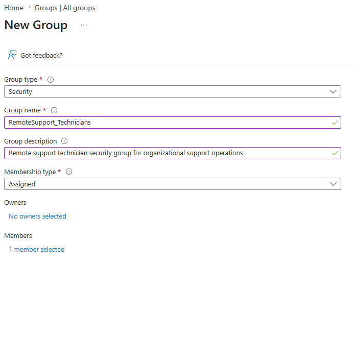
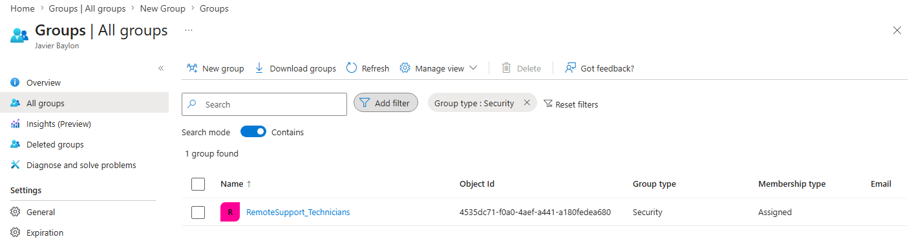

# Microsoft Entra Security Group Management Workflow

## Objective

Create and manage a Microsoft Entra security group to support cloud-based administrative access management and future organizational role assignment workflows.

---

## Ticket Information

### Ticket Category
```text
Identity and Access Management
```

### Priority
```text
Low
```

### Ticket Title
```text
Create Microsoft Entra security group for remote support technicians
```

### Request Source
```text
Systems Administration
```

### Assigned Technician
```text
helpdesk
```

---

## Environment

### Systems
- HELPDESK01

### Technologies
- Microsoft Entra ID
- Microsoft 365 Business Premium
- Windows 11 Pro

---

## Workflow

### 1. Accessed Microsoft Entra Admin Center
Signed into:
```text
entra.microsoft.com
```

---

### 2. Navigated to Group Management
Opened:
```text
Groups → All Groups
```

within Microsoft Entra Admin Center.

---

### 3. Created Security Group
Created a new security group using the following configuration:

| Setting | Value |
|---|---|
| Group Type | Security |
| Group Name | RemoteSupport_Technicians |
| Membership Type | Assigned |

---

### 4. Configured Group Description
Configured the group description to identify the group as a cloud-based support administration security group.

---

### 5. Added Group Members
Added authorized support personnel to the security group.

Example member:
```text
helpdesk@helpdeskhomelab.onmicrosoft.com
```

---

### 6. Verified Group Configuration
Verified:
- successful group creation
- member assignment
- group visibility within Microsoft Entra Admin Center

---

## Validation

### Successful Validation
- Microsoft Entra security group created successfully
- Assigned membership configuration applied successfully
- Support personnel added successfully
- Group visibility verified successfully
- Organizational cloud access management structure established successfully

---

## Key Concepts Practiced

- Microsoft Entra ID
- Security Groups
- Role-Based Access Control (RBAC)
- Cloud Identity Management
- Organizational Access Management
- Assigned Group Membership
- Administrative Group Structure
- Microsoft 365 Administration
- Help Desk Operations
- Modern IT Administration

---

## Ticket Notes

### Title

```text
Requesting creation of a Microsoft Entra security group for remote support technicians to support future cloud-based administrative access management and organizational role assignment workflows.
```

---

### Final Resolution

```text
Created Microsoft Entra security group RemoteSupport_Technicians successfully. Added authorized support personnel and verified successful group membership assignment within Microsoft Entra Admin Center.
```

---

## Supporting Artifacts

[Spiceworks Ticket Activity PDF](../tickets/entra-security-group-management-ticket.pdf)

---

## Screenshots

### Group Creation Window



---

### Entra Group Overview


