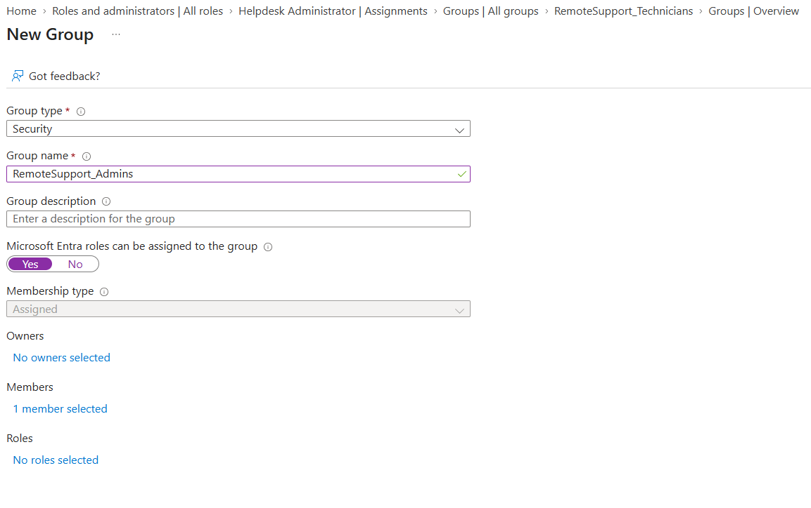
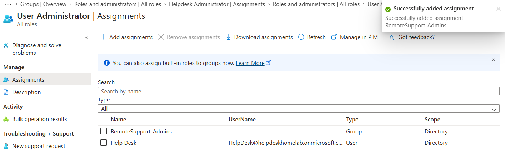
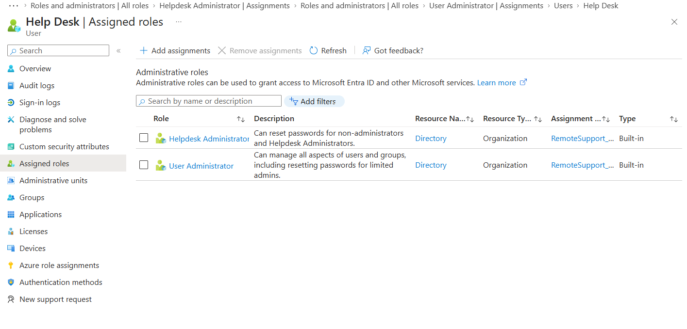

# Group-Based RBAC Management in Microsoft Entra ID

## Objective

Implement centralized role-based access control (RBAC) within Microsoft Entra ID by transitioning from direct user administrative role assignments to group-based privileged role inheritance using role-assignable security groups.

---

## Ticket Information

### Ticket Category
```text
Identity and Access Management
```

### Priority
```text
Low
```

### Ticket Title
```text
Requesting transition from direct Microsoft Entra administrative role assignments to group-based role management for remote support personnel.
```

### Request Source
```text
Systems Administration
```

### Assigned Technician
```text
helpdesk
```

---

## Environment

### Systems
- HELPDESK01

### Technologies
- Microsoft Entra ID
- Microsoft 365 Business Premium
- Windows 11 Pro

---

## Existing Environment

### Previous Administrative Structure
Administrative roles were previously assigned directly to the:
```text
helpdesk@helpdeskhomelab.onmicrosoft.com
```

user account.

Existing direct role assignments:
- Helpdesk Administrator
- User Administrator

---

## Workflow

### 1. Reviewed Existing Administrative Structure
Verified existing direct Microsoft Entra administrative role assignments for the helpdesk account.

---

### 2. Validated Existing Security Group
Reviewed the previously created:
```text
RemoteSupport_Technicians
```

security group for potential administrative role assignment usage.

---

### 3. Identified RBAC Limitation
Discovered standard Microsoft Entra security groups could not inherit privileged administrative roles without role-assignable group configuration.

---

### 4. Created Role-Assignable Security Group
Created a dedicated role-assignable security group:

```text
RemoteSupport_Admins
```

Configured:
- Security group type
- Assigned membership
- Role-assignable group functionality

---

### 5. Added Administrative Members
Added:
```text
helpdesk@helpdeskhomelab.onmicrosoft.com
```

to the role-assignable administrative group.

---

### 6. Assigned Administrative Roles to Group
Assigned the following Microsoft Entra administrative roles directly to the:
```text
RemoteSupport_Admins
```

group:
- Helpdesk Administrator
- User Administrator

---

### 7. Removed Direct User Assignments
Removed direct administrative role assignments from the individual helpdesk account to transition fully to centralized group-based RBAC management.

---

### 8. Validated Inherited Administrative Access
Verified the helpdesk account successfully inherited:
- Helpdesk Administrator permissions
- User Administrator permissions

through group membership inheritance.

---

## Validation

### Successful Validation
- Role-assignable security group created successfully
- Administrative group membership assigned successfully
- Microsoft Entra administrative roles assigned successfully
- Direct administrative assignments removed successfully
- Inherited administrative permissions verified successfully
- Centralized RBAC structure implemented successfully

---

## Key Concepts Practiced

- Microsoft Entra ID
- Role-Based Access Control (RBAC)
- Administrative Role Inheritance
- Role-Assignable Security Groups
- Centralized Identity Management
- Cloud Administrative Architecture
- Privileged Access Management
- Organizational Access Management
- Microsoft 365 Administration
- Modern IT Administration

---

## Ticket Notes

### Ticket Summary

```text
Requesting transition from direct Microsoft Entra administrative role assignments to group-based role management for remote support personnel.
```

---

### Final Resolution

```text
Successfully implemented group-based administrative role assignment within Microsoft Entra ID using a role-assignable security group. Assigned Helpdesk Administrator and User Administrator roles to the RemoteSupport_Admins group and verified inherited administrative permissions through group membership. Confirmed continued help desk administrative functionality following transition from direct user-based role assignments to centralized RBAC management.
```

---

## Supporting Artifacts

[Spiceworks Ticket Activity PDF](../tickets/group-based-rbac-management-ticket.pdf)

---

## Screenshots

### Role-Assignable Group Creation



---

### Administrative Role Assignment



---

### Inherited Administrative Permissions


