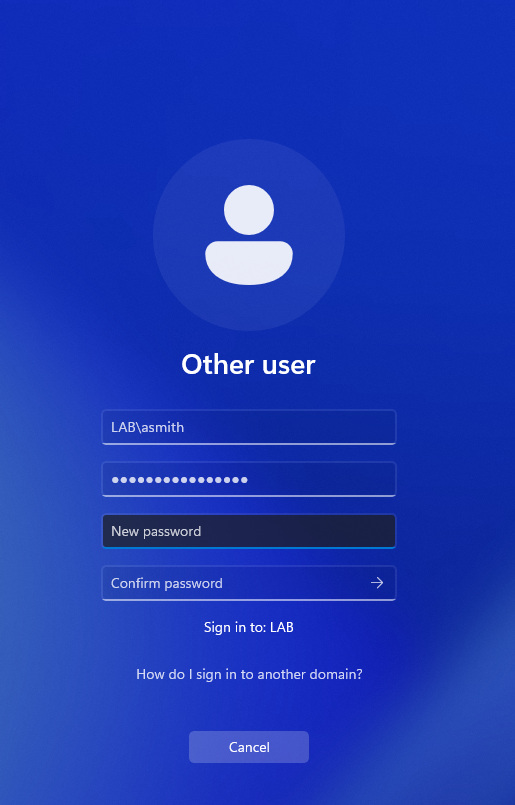
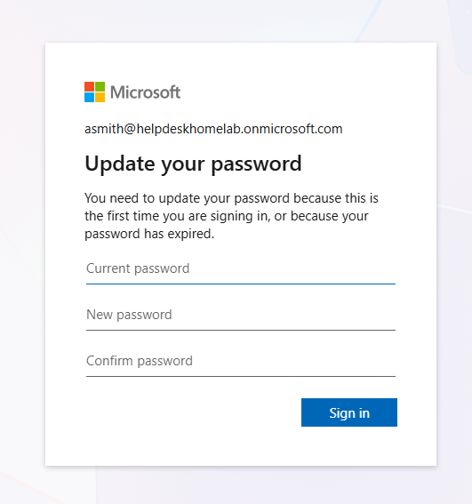
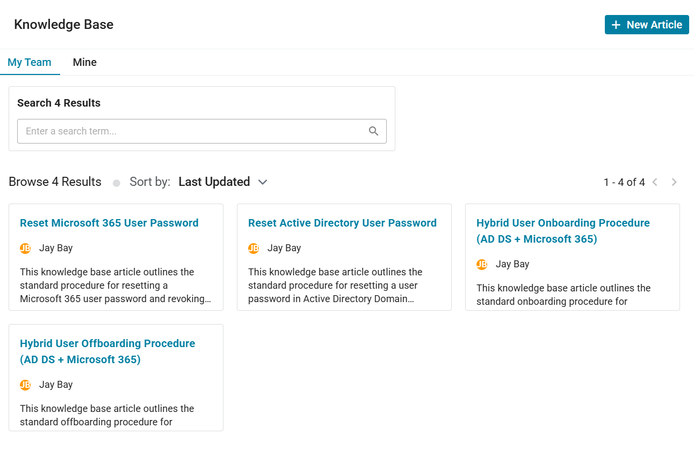

# Hybrid Password Reset Workflow

## Objective

Perform a hybrid password reset workflow by resetting both Active Directory and Microsoft 365 passwords for a standard user account while validating restored organizational access.

---

## Ticket Information

### Ticket Category
```text
Account Issues
```

### Priority
```text
Medium
```

### Ticket Title
```text
User unable to access company account due to forgotten password
```

### Request Source
```text
Alex Smith
```

---

## Environment

### Systems
- DC01
- HELPDESK01
- CLIENT01

### Technologies
- Active Directory Domain Services (AD DS)
- Microsoft 365 Business Premium
- Microsoft Entra ID
- Authenticator
- Spiceworks Help Desk

---

## User Information

| Account Type | Username |
|---|---|
| Active Directory | LAB\asmith |
| Microsoft 365 | asmith@helpdeskhomelab.onmicrosoft.com |

---

## Active Directory Password Reset

### 1. Opened ADUC
Using RSAT tools from HELPDESK01, Active Directory Users and Computers (ADUC) was opened.

### 2. Located User Account
Located the `LAB\asmith` account within the Standard Users organizational unit.

### 3. Reset Active Directory Password
Reset the user's Active Directory password and configured:
```text
User must change password at next logon
```

to enforce standard password security practices.

### 4. Verified Account Status
Verified the account remained enabled and accessible following the password reset.

---

## Microsoft 365 Password Reset

### 5. Accessed Microsoft 365 Admin Center
Signed into the Microsoft 365 Admin Center using the helpdesk administrative account.

### 6. Reset Cloud Password
Reset the Microsoft 365 password for:
```text
asmith@helpdeskhomelab.onmicrosoft.com
```

Configured:
```text
Require this user to change their password when they first sign in
```

during the reset process.

### 7. Revoked Active Sessions
Revoked active Microsoft 365 sessions to invalidate existing authentication tokens and enforce reauthentication.

---

## Validation

### Successful Validation
- Active Directory password reset completed successfully
- Microsoft 365 password reset completed successfully
- Active sessions revoked successfully
- User successfully authenticated using updated credentials
- Password change requirement enforced successfully
- Organizational access restored successfully

---

## Key Concepts Practiced

- Password Reset Procedures
- Active Directory Administration
- Microsoft 365 Administration
- Microsoft Entra ID
- Session Revocation
- Identity Management
- Authentication Troubleshooting
- Delegated Administration
- Help Desk Operations
- Security Best Practices

---

## Ticket 

[Spiceworks Ticket Activity PDF](../tickets/hybrid-password-reset-ticket.pdf)

---

## Screenshots

### Active Directory Password Reset



---

### Microsoft 365 Password Reset



---

### Session Revocation


---

### Update Knowledge Base


