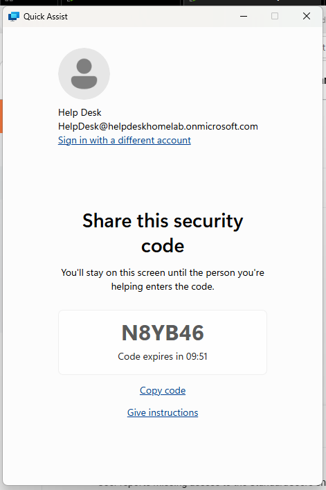
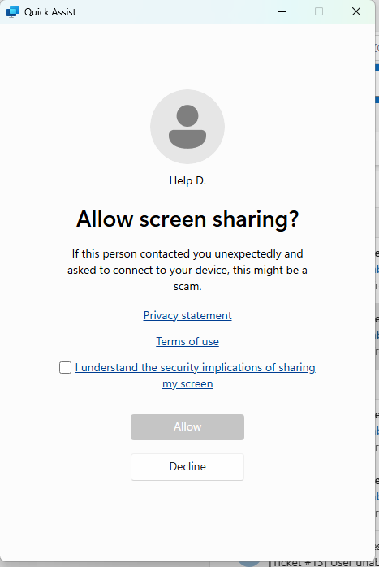
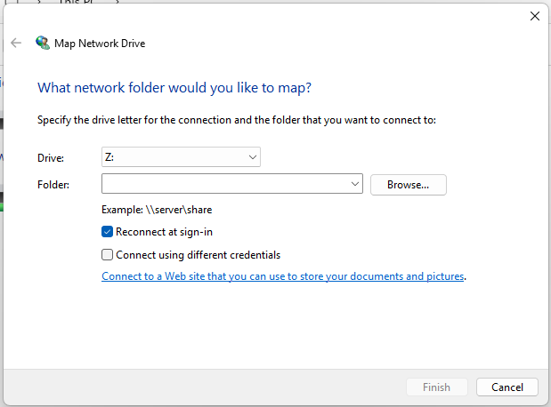
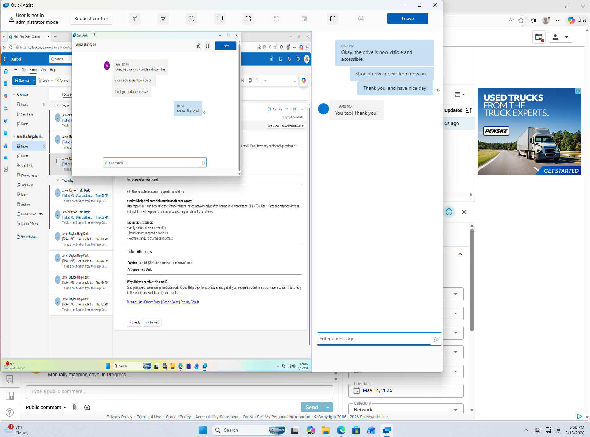
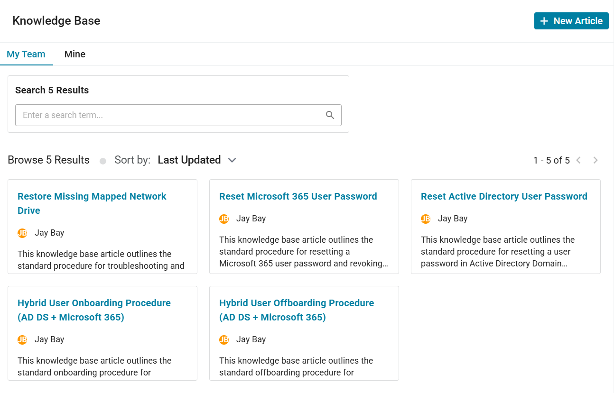

# Remote Support - Missing Mapped Drive Workflow

## Objective

Troubleshoot and restore access to a missing mapped network drive using remote support tools while validating shared resource accessibility for a domain user.

---

## Ticket Information

### Ticket Category
```text
Network Access
```

### Priority
```text
Low
```

### Ticket Title
```text
User unable to access mapped shared drive
```

### Request Source
```text
Alex Smith
```

### Assigned Technician
```text
helpdesk
```

---

## Environment

### Systems
- DC01
- HELPDESK01
- CLIENT01

### Technologies
- Active Directory Domain Services (AD DS)
- Shared Network Folders
- Quick Assist
- Spiceworks Help Desk

---

## User Information

| Account Type | Username |
|---|---|
| Active Directory | LAB\asmith |
| Workstation | CLIENT01 |

---

## Issue Description

The user reported that the standard shared network drive never appeared in File Explorer after initially signing into the workstation. The user was unable to access shared organizational resources required for normal workflow operations.

---

## Troubleshooting Workflow

### 1. Initiated Remote Support Session
Using Quick Assist from HELPDESK01, a remote support session was established with CLIENT01.

### 2. Verified User Issue
Confirmed the mapped network drive was missing from File Explorer during the remote session.

### 3. Validated Shared Resource Path
Verified the shared folder path:
```text
\\DC01\StandardUsers
```

was reachable and accessible.

### 4. Restored Mapped Drive
Mapped the shared network folder to:
```text
S:
```

using the Map Network Drive workflow in File Explorer.

Enabled:
```text
Reconnect at sign-in
```

to persist the mapping during future logins.

### 5. Verified Shared Resource Access
Confirmed successful access to shared organizational files and validated standard user permissions.

---

## Validation

### Successful Validation
- Quick Assist remote session established successfully
- Shared network path reachable successfully
- Mapped drive restored successfully
- Shared resource access verified successfully
- User workflow functionality restored successfully

---

## Key Concepts Practiced

- Remote Support
- Quick Assist
- Shared Network Folders
- Mapped Drives
- Active Directory User Support
- Help Desk Troubleshooting
- Organizational Resource Access
- User Support Workflow
- Network Path Validation
- Tier 1 Help Desk Operations

---

## Supporting Artifact

[Spiceworks Ticket Activity PDF](../tickets/mapped-drive-remote-support-ticket.pdf)

---

## Screenshots

### Help Desk Quick Assist Remote Session



---

### User Quick Assist Remote Session



---

### Map Network Drive Window



---

### Help Desk Point of View



---

### Update Knowledge Base


