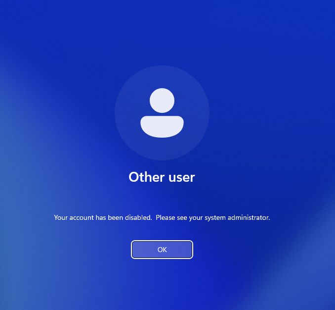
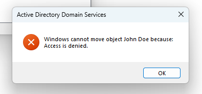
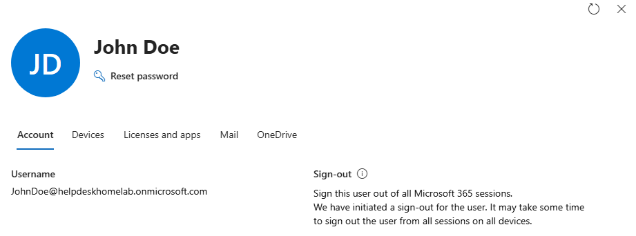
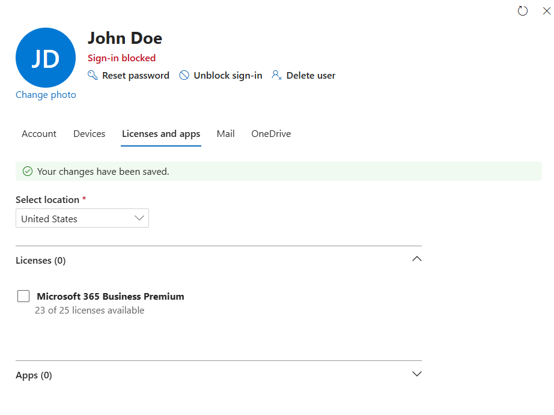
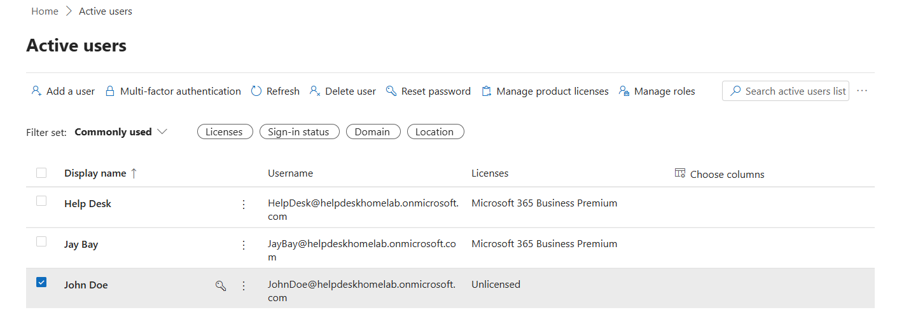

# User Offboarding Workflow

## Objective

Perform a hybrid user offboarding workflow by revoking both on-premises Active Directory access and Microsoft 365 cloud access for a terminated employee account.

---

## Ticket Information

### Ticket Category
```text
Onboarding / Offboarding
```

### Ticket Title
```text
Offboard employee John Doe and revoke system access
```

### Request Source
```text
HR Department
```

---

## Environment

### Systems
- DC01
- HELPDESK01
- CLIENT01

### Technologies
- Active Directory
- Microsoft 365 Business Premium
- Microsoft Entra ID
- Microsoft Authenticator
- Spiceworks

---

## User Information

| Account Type | Username |
|---|---|
| Active Directory | LAB\jdoe |
| Microsoft 365 | jdoe@helpdeskhomelab.onmicrosoft.com |

---

## Offboarding Tasks Performed

### Active Directory Tasks

#### 1. Disabled AD Account
Using RSAT tools from HELPDESK01, the `LAB\jdoe` account was disabled in Active Directory Users and Computers.

#### 2. Verified Account Disablement
Verified the account displayed the disabled account indicator within ADUC.

#### 3. Attempted OU Relocation
Attempted to move the disabled user account into the `Disabled Users` organizational unit.

This action failed due to insufficient permissions and was escalated to the systems administration team.

---

### Microsoft 365 Tasks

#### 4. Revoked Active Sessions
Revoked active Microsoft 365 sessions for the user account using the helpdesk administrative account.

#### 5. Escalated Cloud Administrative Actions
Cloud account disablement and license removal were escalated to the Global Administrator account due to permission restrictions on the Helpdesk Administrator role.

#### 6. Blocked Microsoft 365 Sign-In
The Global Administrator account blocked Microsoft 365 sign-in access for the user.

#### 7. Removed Business Premium License
Removed the Microsoft 365 Business Premium license assigned to the user account.

---

## Validation

### Successful Validation
- Active Directory account disabled successfully
- Microsoft 365 active sessions revoked successfully
- Microsoft 365 sign-in access blocked successfully
- Business Premium license removed successfully

### Escalation Validation
- OU relocation required escalation due to insufficient permissions
- Cloud administrative actions required Global Administrator permissions

---

## Key Concepts Practiced

- User Offboarding
- Active Directory Administration
- Microsoft 365 Administration
- Microsoft Entra ID
- Role-Based Access Control (RBAC)
- Delegated Administration
- Access Revocation
- Identity Lifecycle Management
- Administrative Escalation
- License Management

---

## Ticket Notes

### Help Desk Update

```text
Disabled local Active Directory account for jdoe and revoked active Microsoft 365 sessions successfully. Escalated cloud account disablement and license removal to Global Administrator due to administrative permission restrictions.
```

### Systems Administration Update

```text
Blocked Microsoft 365 sign-in access for jdoe and removed assigned Business Premium license as part of standard offboarding procedure.
```

## Supporting Artifacts

[Spiceworks Ticket Activity PDF](../artifacts/scenarios/user-offboarding/user-offboarding-ticket.pdf)

---

## Related Knowledge Base

- [Hybrid User Offboarding Procedure](../knowledge-base/hybrid-user-offboarding.md)

## Screenshots

### Disabled Active Directory Account



---

### Active Directory Permission Escalation



---

### Microsoft 365 Session Revocation



---

### Microsoft 365 Sign-In Blocked



---

### License Removal



---

### Update Knowledge Base


