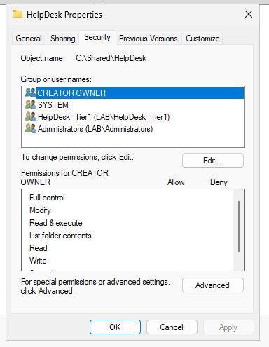
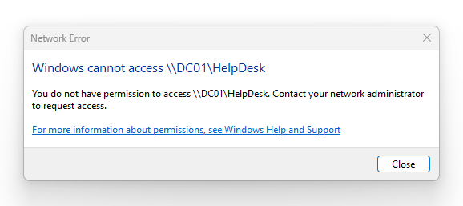
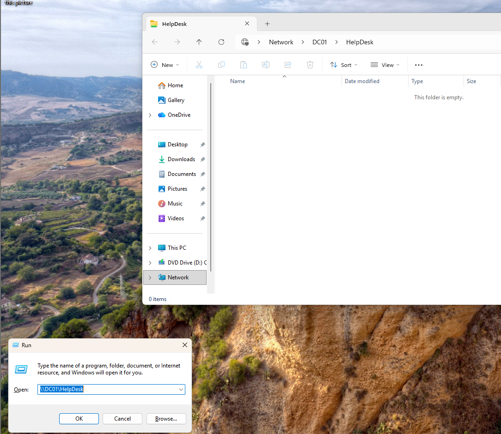

# Shared Folder Permissions

## Objective

Configure shared folder access using Active Directory security groups and NTFS permissions while enforcing least privilege access between help desk staff and standard users.

---

## Environment

### Systems
- DC01
- HELPDESK01
- CLIENT01

### Technologies
- Windows Server 2025
- Active Directory
- NTFS Permissions
- SMB File Sharing
- Security Groups

---

## Folder Structure

### Shared Folders
```text
C:\Shared\HelpDesk
C:\Shared\StandardUsers
```

### Security Groups
- HelpDesk_Tier1

---

## Access Design

| User | HelpDesk Share | StandardUsers Share |
|---|---|---|
| LAB\helpdesk | Allowed | Allowed |
| LAB\jdoe | Denied | Allowed |

---

## Configuration Steps

### 1. Created Shared Folders
Created departmental shared folders on DC01.

### 2. Configured SMB Sharing
Enabled file sharing using Advanced Sharing settings.

### 3. Assigned Security Groups
Configured access using the `HelpDesk_Tier1` security group instead of assigning permissions directly to user accounts.

### 4. Configured NTFS Permissions
Assigned appropriate NTFS permissions to:
- HelpDesk_Tier1
- Domain Users

### 5. Disabled Permission Inheritance
The HelpDesk share inherited permissions from the parent `C:\Shared` directory which unintentionally granted access to standard users through inherited group permissions.

Inheritance was disabled and converted into explicit permissions to allow custom access control configuration.

### 6. Removed Unnecessary Access
Removed inherited access entries that allowed standard users to access the HelpDesk share.

---

## Validation

### Successful Validation
- `LAB\helpdesk` successfully accessed:
  - `\\DC01\HelpDesk`
  - `\\DC01\StandardUsers`

### Access Restriction Validation
- `LAB\jdoe` successfully accessed:
  - `\\DC01\StandardUsers`

- `LAB\jdoe` received access denied when attempting to access:
  - `\\DC01\HelpDesk`

---

## Troubleshooting Notes

### Inherited Permissions Issue

The HelpDesk shared folder initially inherited permissions from the parent directory which allowed unintended access for standard users.

This issue was resolved by:
1. Disabling NTFS inheritance
2. Converting inherited permissions into explicit permissions
3. Removing unnecessary access entries
4. Assigning explicit permissions to the appropriate security groups

---

## Key Concepts Practiced

- NTFS Permissions
- Share Permissions
- Permission Inheritance
- Security Groups
- Least Privilege Access
- Role-Based Access Control (RBAC)
- Access Validation
- Windows File Sharing

---

## Screenshots

### HelpDesk_Tier1 Security Group


---

### HelpDesk NTFS Permissions



---

### Access Denied Validation



---

### Successful HelpDesk Share Access


