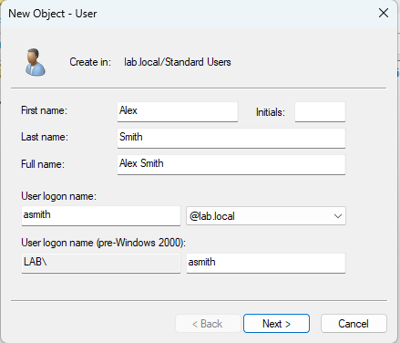
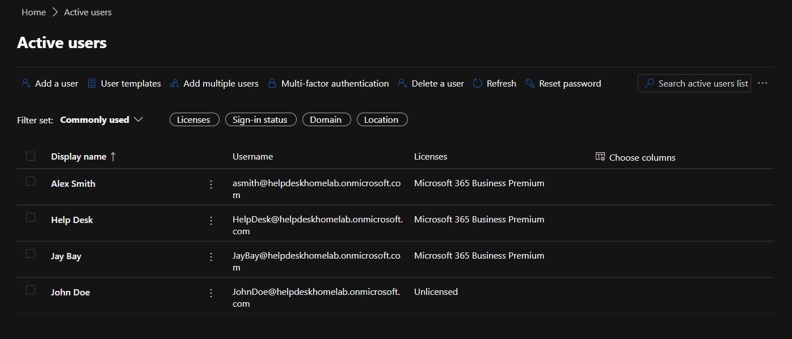
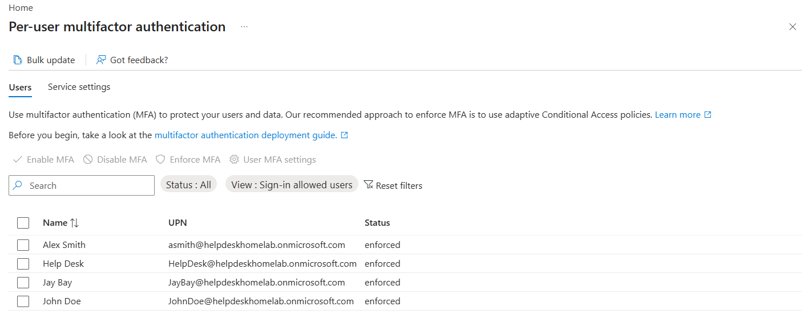
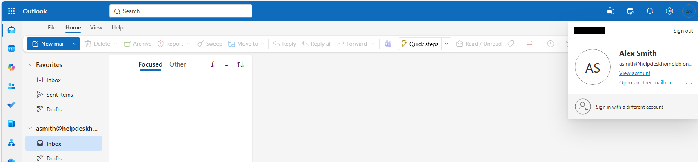

# User Onboarding Workflow

## Objective

Perform a hybrid user onboarding workflow by provisioning both Active Directory and Microsoft 365 access for a new employee account while following realistic help desk escalation and administrative procedures.

---

## Ticket Information

### Ticket Category
```text
Onboarding / Offboarding
```

### Priority
```text
Medium
```

### Ticket Title
```text
Provision new user account and Microsoft 365 access for Alex Smith
```

### Request Source
```text
Sarah Johnson (HR)
```

---

## Environment

### Systems
- DC01
- HELPDESK01
- CLIENT01

### Technologies
- Active Directory Domain Services (AD DS)
- Microsoft 365 Business Premium
- Microsoft Entra ID
- Microsoft Teams
- Outlook Web
- Authenticator
- Spiceworks Help Desk

---

## User Information

| Account Type | Username |
|---|---|
| Active Directory | LAB\asmith |
| Microsoft 365 | asmith@helpdeskhomelab.onmicrosoft.com |

---

## Active Directory Provisioning

### 1. Created Active Directory Account
Using RSAT tools from HELPDESK01, a new Active Directory account was created for Alex Smith.

### 2. Configured Initial User Information
Configured:
- Department
- Job Title

### 3. Assigned Standard Domain Access
Verified the user account received standard domain access and appropriate group membership configuration.

### 4. Configured Password Policy
Enabled:
```text
User must change password at next logon
```

to simulate standard onboarding security practices.

---

## Microsoft 365 Provisioning

### 5. Created Microsoft Entra ID Account
Created a Microsoft 365 cloud account for the user using Microsoft Entra ID administrative tools.

### 6. Escalated License Assignment
Microsoft 365 Business Premium license assignment required escalation to the Global Administrator account due to licensing permission restrictions.

### 7. Assigned Business Premium License
The Global Administrator account assigned the Microsoft 365 Business Premium license successfully.

---

## User Onboarding Tasks

### 8. Initial User Sign-In
Verified successful Microsoft 365 sign-in using the new user account.

### 9. Password Change
The user completed the required password change during initial sign-in.

### 10. MFA Enrollment
The user completed Multi-Factor Authentication (MFA) enrollment using an Authenticator.

### 11. Verified Cloud Services
Verified successful access to:
- Outlook Web
- Microsoft Teams
- OneDrive

---

## Validation

### Successful Validation
- Active Directory account created successfully
- Microsoft Entra ID account provisioned successfully
- Business Premium license assigned successfully
- MFA enrollment completed successfully
- Outlook access verified
- Teams access verified
- OneDrive access verified

### Escalation Validation
- License assignment required Global Administrator escalation due to permission boundaries

---

## Key Concepts Practiced

- User Onboarding
- Active Directory Administration
- Microsoft Entra ID
- Microsoft 365 Administration
- Multi-Factor Authentication (MFA)
- Delegated Administration
- Role-Based Access Control (RBAC)
- License Management
- Identity Lifecycle Management
- Help Desk Operations
- Administrative Escalation

---

## Ticket Notes

### Help Desk Update

```text
Created Active Directory account for asmith successfully. Configured initial user information, assigned standard domain access, and enabled password change requirement at first sign-in. Proceeding with Microsoft 365 account provisioning and cloud access configuration.
```

---

### Help Desk Cloud Provisioning Update

```text
Provisioned Microsoft Entra ID user account for asmith successfully. Escalated Microsoft 365 license assignment to Global Administrator due to licensing permission restrictions.
```

---

## Supporting Artifacts

[Spiceworks Ticket Activity PDF](../tickets/user-onboarding-ticket.pdf)

---

## Screenshots

### Active Directory User Creation



---

### Microsoft User Provisioning & License



---

### MFA Enrollment



---

### Outlook Web Access



---
