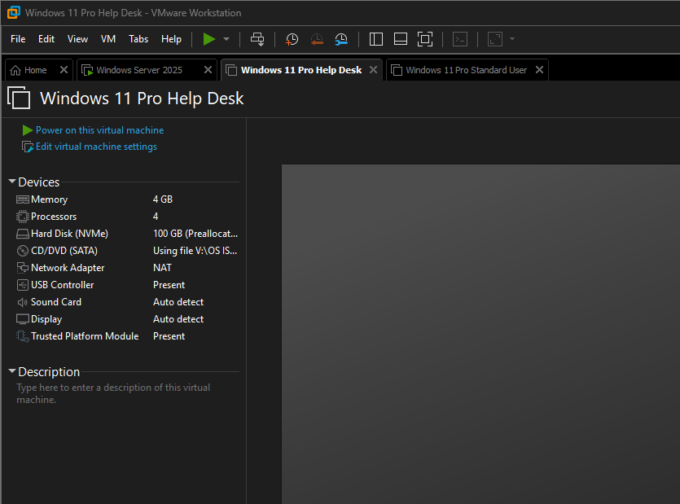

# VMware Lab Setup

## Objective

Create a virtualized Tier 1 help desk lab environment using VMware Workstation Pro to simulate a small business Windows domain environment.

---

## Environment

### Hypervisor
- VMware Workstation Pro

### Operating Systems
- Windows Server 2025
- Windows 11 Pro

### Virtual Machines

| Device Name | Purpose |
|---|---|
| DC01 | Domain Controller |
| HELPDESK01 | Tier 1 Help Desk Workstation |
| CLIENT01 | Standard User Workstation |

---

## Network Configuration

- NAT networking was used for all virtual machines
- A static IP address was assigned to the domain controller
- Client systems used the domain controller for DNS resolution

---

## Resource Allocation

### DC01
- 4 vCPUs
- 4 GB RAM

### HELPDESK01
- 4 vCPUs
- 4 GB RAM

### CLIENT01
- 4 vCPUs
- 4 GB RAM

---

## Validation

- All virtual machines powered on successfully
- Systems communicated successfully over the virtual network
- Internet connectivity verified through NAT networking

---

## Screenshots

### VMware Environment Overview

