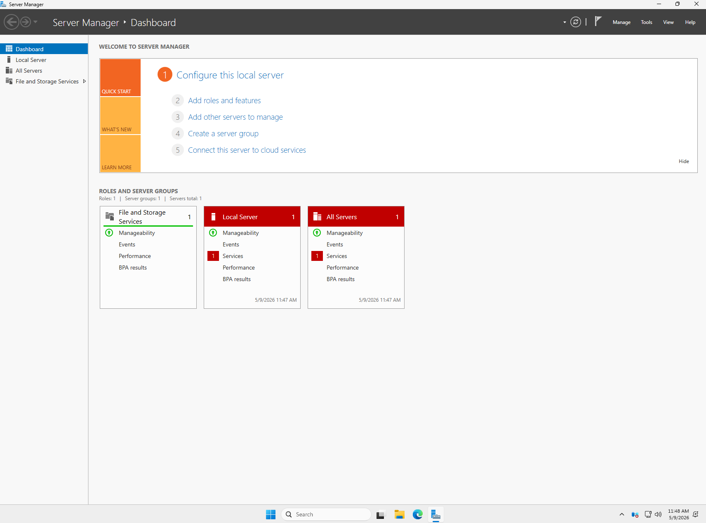
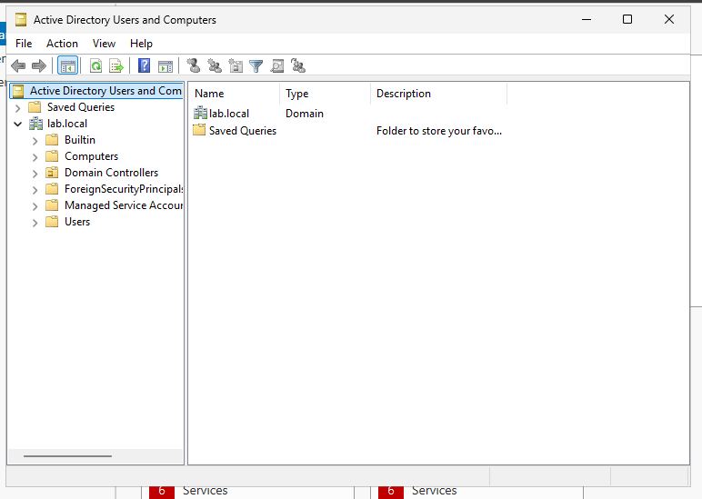
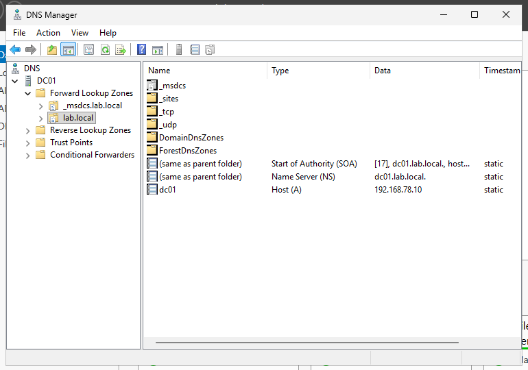
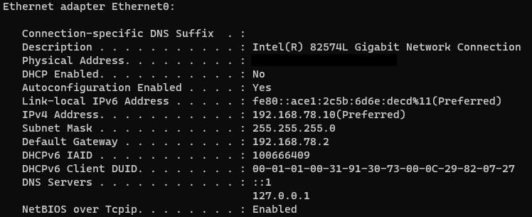
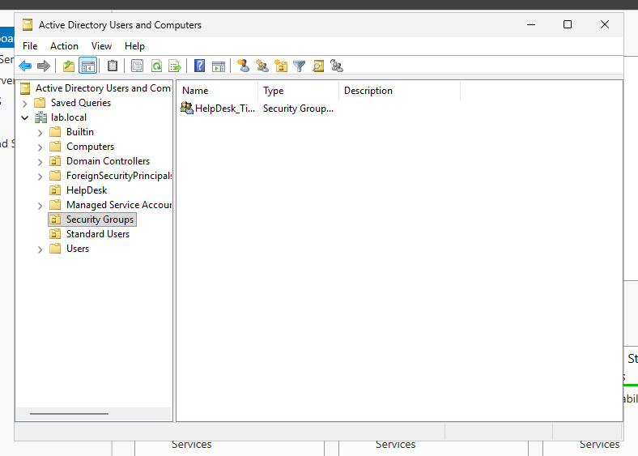

# Active Directory Setup

## Objective

Configure a Windows Server 2025 domain controller for a simulated small business help desk environment.

---

## Environment

- Windows Server 2025
- VMware Workstation Pro
- NAT networking
- Static IPv4 configuration

---

## Configuration Steps

1. Renamed the server to `DC01`
2. Configured a static IPv4 address
3. Installed Active Directory Domain Services
4. Installed DNS Server role
5. Promoted the server to a domain controller
6. Created a new forest: `lab.local`
7. Created Organizational Units for support and standard users
8. Created domain user accounts

---

## Organizational Structure

### Organizational Units
- HelpDesk
- Standard Users

### Domain Accounts
- LAB\helpdesk
- LAB\jdoe

---

## Security Groups

### Created Groups
- HelpDesk_Tier1

### Group Purpose
The HelpDesk_Tier1 group was created to simulate delegated Tier 1 workstation administration privileges without assigning full domain administrator permissions.

---

## Validation

- Domain controller promotion completed successfully
- DNS records created successfully
- Domain users authenticated successfully
- Domain services accessible from client systems

---

## Troubleshooting Notes

### Static IP Warning

A prerequisite check initially warned that no static IP address was configured. The active network adapter was reconfigured with a static IPv4 address and verified using `ipconfig`.

### No Internet Warning

After configuring loopback DNS (`127.0.0.1`), Windows temporarily displayed a no internet access warning until DNS services were fully installed and operational.

### Blank Administrator Password

Domain controller promotion initially failed because the local Administrator account did not meet password requirements. A strong password was configured before rerunning prerequisite validation.

---

## Screenshots

### Server Manager

---

### Active Directory Users and Computers

---

### DNS Manager

---

### Static IP Configuration

---

### Security Groups

