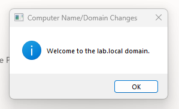
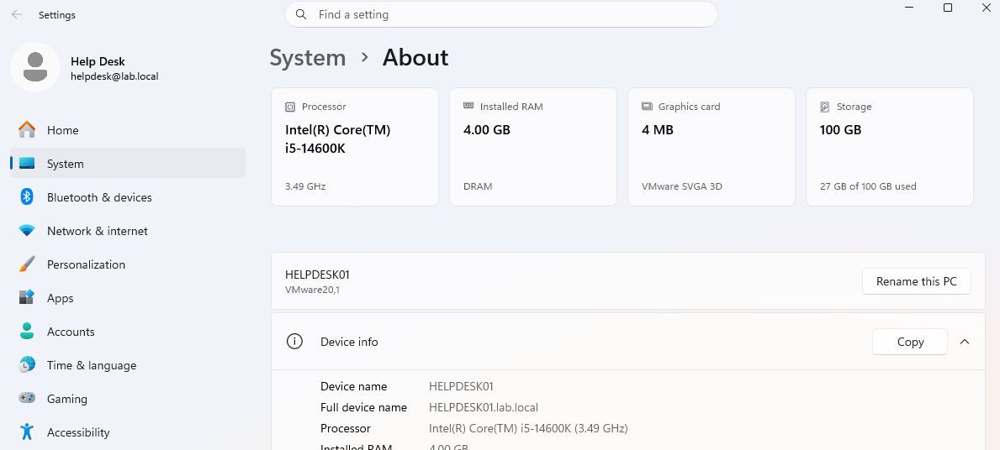
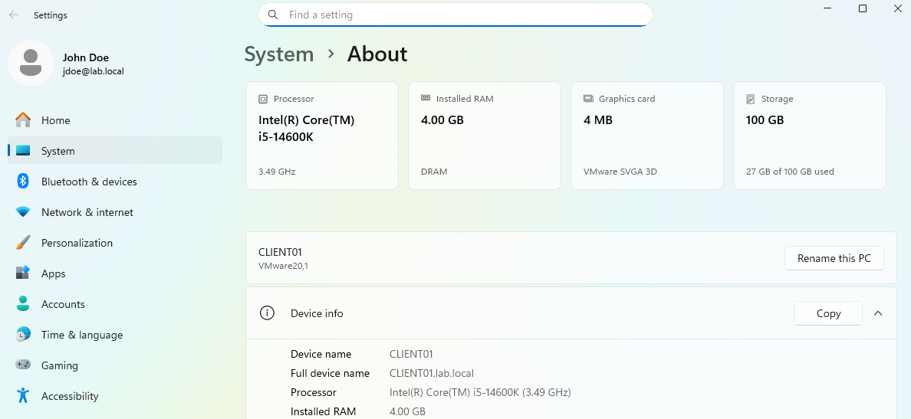
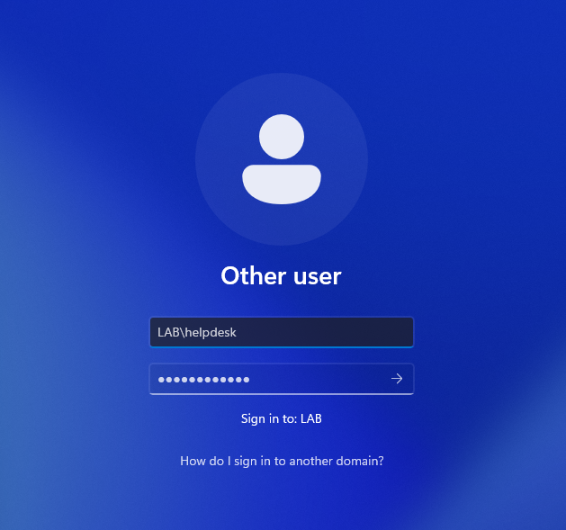
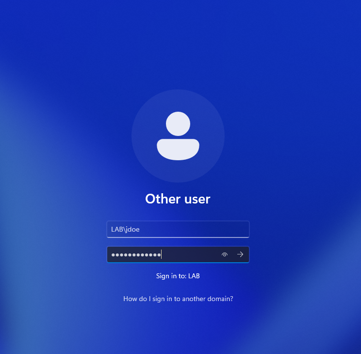

# Domain Join Configuration

## Objective

Join Windows 11 client systems to the `lab.local` Active Directory domain and verify domain authentication.

---

## Systems Joined

| Device | Role |
|---|---|
| HELPDESK01 | Tier 1 Help Desk Workstation |
| CLIENT01 | Standard User Workstation |

---

## Configuration Steps

1. Renamed client systems
2. Configured DNS settings to use the domain controller
3. Verified network communication with the domain controller
4. Joined both systems to the `lab.local` domain
5. Rebooted systems after domain join
6. Verified domain authentication using Active Directory accounts

---

## Validation

- Both systems successfully joined the domain
- Domain login functionality verified
- Domain authentication functioning properly
- Systems visible in Active Directory

---

## Troubleshooting Notes

### Domain Login Failure

Initial attempts to login using domain credentials failed because domain user accounts had not yet been created in Active Directory.

After creating the required domain accounts inside the appropriate Organizational Units, authentication succeeded successfully.

---

## Screenshots

### Successful Domain Join

---

### HELPDESK01 Domain Membership

---

### CLIENT01 Domain Membership

---

### HELDESK01 Login

---

### CLIENT01 Login

