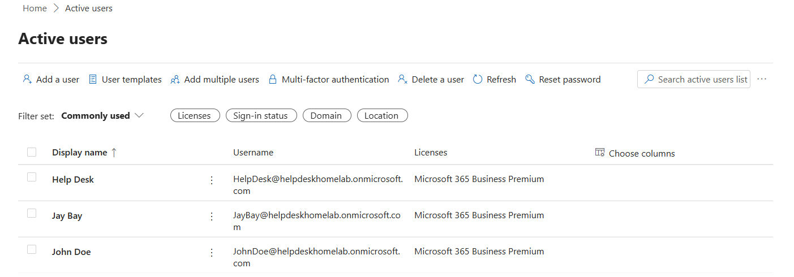

# Microsoft 365 Setup

## Objective

Configure a Microsoft 365 Business Premium environment to simulate modern cloud-based help desk administration and user onboarding workflows.

---

## Environment

### Systems
- HELPDESK01
- CLIENT01

### Technologies
- Microsoft 365 Business Premium
- Microsoft Admin Center
- Authenticator
- Multi-Factor Authentication (MFA)

---

## Tenant Information

### Tenant Domain
```text
helpdeskhomelab.onmicrosoft.com
```

### Administrative Structure

| Account | Role |
|---|---|
| JayBay | Global Administrator |
| HelpDesk | Helpdesk Administrator |
| JohnDoe | Standard User |

---

## Configuration Steps

### 1. Created Microsoft 365 Tenant
Configured a Microsoft 365 Business Premium tenant for the lab environment.

### 2. Created Cloud User Accounts
Created the following cloud-based user accounts:
- HelpDesk@helpdeskhomelab.onmicrosoft.com
- JohnDoe@helpdeskhomelab.onmicrosoft.com

### 3. Assigned Business Premium Licenses
Assigned Microsoft 365 Business Premium licenses to all lab users.

### 4. Configured Administrative Roles
Assigned the `Helpdesk Administrator` role to the helpdesk account to simulate delegated Tier 1 support responsibilities while maintaining separation from the Global Administrator account.

### 5. Configured MFA
Enabled Multi-Factor Authentication (MFA) for the helpdesk account using an Authenticator.

### 6. Verified User Access
Successfully logged into Microsoft 365 services using the helpdesk and jdoe accounts.

---

## Validation

### Successful Validation
- Microsoft 365 tenant created successfully
- User accounts provisioned successfully
- Business Premium licenses assigned successfully
- MFA configured successfully
- Helpdesk Administrator role assigned successfully
- Cloud user authentication verified successfully

---

## Key Concepts Practiced

- Microsoft 365 Administration
- Microsoft Entra ID
- Multi-Factor Authentication (MFA)
- Cloud Identity Management
- Role-Based Access Control (RBAC)
- License Assignment
- User Provisioning
- Delegated Administration
- Cloud Authentication

---

## Screenshots

### Microsoft 365 Active Users & License



---

### MFA Enforcement


---

### Helpdesk Administrator Role


---

### Successful HelpDesk Microsoft 365 Login


---

### Successful Standard User Microsoft 365 Login


